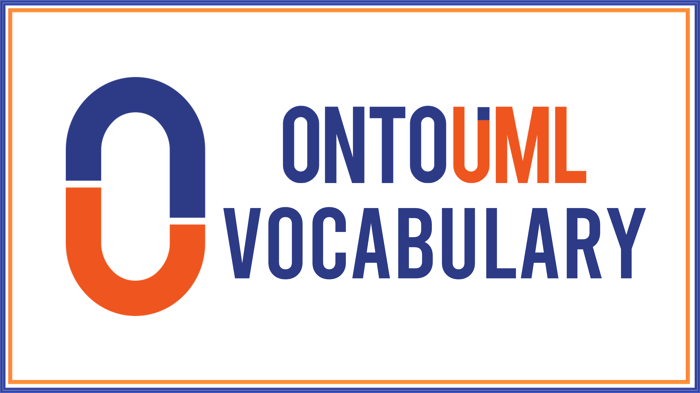

# OntoUML Vocabulary

The [OntoUML Vocabulary](https://w3id.org/ontouml/vocabulary) is an implementation of the [OntoUML Metamodel](https://w3id.org/ontouml/metamodel) in the Web Ontology Language (OWL) that is easily interoperable with [ontouml-js](https://github.com/OntoUML/ontouml-js) and [ontouml-schema](https://w3id.org/ontouml/schema).

This vocabulary supports the serialization, exchange, and publishing of OntoUML models as linked data and is licensed under [CC-BY-SA 4.0](https://creativecommons.org/licenses/by-sa/4.0/).

## Documentation

The complete documentation of this vocabulary is available [here](https://w3id.org/ontouml/vocabulary/doc). 

## Known uses

- The [OntoUML/UFO Catalog](https://github.com/OntoUML/ontouml-models) uses this Vocabulary for the serialization of its models as linked data. 

## Tools

- [ontouml-json2ttl](https://w3id.org/ontouml/json2graph) is a Python library that transforms OntoUML models serialized in JSON structured according to the [ontouml-schema](https://github.com/OntoUML/ontouml-schema) into linked data in compliance with the OntoUML Vocabulary.

- [`ontouml-js`](https://github.com/OntoUML/ontouml-js) is a Typescript library to create, manipulate, and query OntoUML models that can serialize them as linked data in compliance with the OntoUML Vocabulary.

## Contributors

This project is maintained by the [Semantics, Cybersecurity & Services (SCS) Group](https://www.utwente.nl/en/eemcs/scs/) of the [University of Twente](https://www.utwente.nl/), The Netherlands.

The main contributors are:

- [Tiago Prince Sales](https://orcid.org/0000-0002-5385-5761) [[GitHub]](https://github.com/tgoprince) [[LinkedIn]](https://www.linkedin.com/in/tiago-sales/)
- [Claudenir M. Fonseca](https://orcid.org/0000-0003-2528-3118) [[GitHub]](https://github.com/claudenirmf) [[LinkedIn]](https://www.linkedin.com/in/claudenir-fonseca-52b251216/)
- [Pedro Paulo Favato Barcelos](https://orcid.org/0000-0003-2736-7817) [[GitHub]](https://github.com/pedropaulofb) [[LinkedIn]](https://www.linkedin.com/in/pedro-paulo-favato-barcelos/)

## Contact

To report bug, request a extension, ask a question, or report a usage of the vocabulary, please [open an issue](https://github.com/OntoUML/ontouml-vocabulary/issues) on this Github repository. 