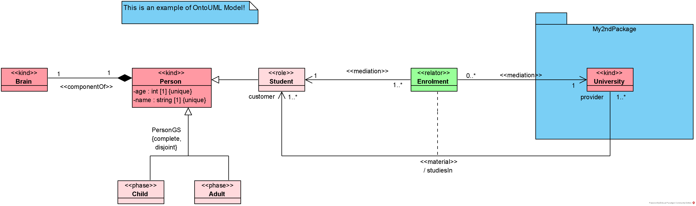

# Brief User Guide

This section provides a comprehensive overview of the content that users will encounter when working with a graph that adheres to the OntoUML Vocabulary.

## Setting up an Example

In this section's examples, we will use an OntoUML model created at the [Visual Paradigm](https://www.visual-paradigm.com/download/community.jsp) model editor using the [ontouml-vp-plugin](https://github.com/OntoUML/ontouml-vp-plugin/) and exported to an [OntoUML Schema](https://w3id.org/ontouml/schema)-compliant JSON file. We depict the example model below:



The transformation from JSON to graph was performed using the [OntoUML JSON2Graph Decoder](https://w3id.org/ontouml/json2graph) tool. For a better presentation, the JSON file objects' IDs were manually reduced to create the TTL examples.

This example is composed of the following files, which are [made available to users](https://github.com/OntoUML/ontouml-vocabulary/tree/main/examples):
- `MyExample.vpp`: OntoUML model editable file.
- `MyClassDiagram.png`: Exported image of the created OntoUML model.
- `MyExample.json`: OntoUML model exported as JSON.
- `MyExample.ttl`: OntoUML model exported as a graph in Turtle syntax (`.ttl`).


All code snippets in this section will be presented using the Turtle syntax. Besides the necessary RDF, RDFS, and OWL prefixes, we employ the following ones in this section's examples. However, we omitted them in both the Turtle and SPARQL code representations for the sake of brevity.

```ttl
@prefix : <https://example.org#> .
@prefix ontouml: <https://w3id.org/ontouml#> .
```

The examples have been categorized into four groups: Projects and Diagrams, Model Elements, Views, and Shapes.

## Examples of Serialized Objects

In a regular use case, a model is transformed by a computational tool into an OntoUML Vocabulary-compliant graph. Even though this process is done automatically by a computational tool without human intervention, the manipulation of the resulting graph is important for its diverse possibilities of use. 

The following code examples aim to illustrate the structure of each OntoUML entity when represented in the OntoUML Vocabulary format. Each code snippet provided here encompasses an example of a single entity produced through the JSON-to-graph transformation process. The unique exception is the `Note` entity, which is supported by the OntoUML Vocabulary but not by the exportation feature of the ontouml-vp-plugin version 0.5.3.

### Projects and Diagrams

#### Project

```ttl
:XCY a ontouml:Project ;
    ontouml:diagram :NyB ;
    ontouml:model :XCY_root ;
    ontouml:name "MyExample"@en .
```

#### Diagram

```ttl
:NyB a ontouml:Diagram ;
    ontouml:containsView :DUa, :M9S, :gtP;
    ontouml:name "MyClassDiagram"@en ;
    ontouml:owner :yHW ;
    ontouml:project :XCY .
```

Other containsView properties omitted for brevity.

### Model Elements

#### Cardinality

```ttl
:L71_cardinality a ontouml:Cardinality ;
    ontouml:cardinalityValue "1..*" ;
    ontouml:lowerBound "1" ;
    ontouml:upperBound "*" .
```
#### Class

```ttl
:Ljp a ontouml:Class ;
    ontouml:attribute :nf0, :xrq ;
    ontouml:description "A Person is a human." ;
    ontouml:isAbstract false ;
    ontouml:isDerived false ;
    ontouml:isPowertype false ;
    ontouml:name "Person"@en ;
    ontouml:order "1"^^xsd:nonNegativeInteger ;
    ontouml:project :XCY ;
    ontouml:restrictedTo ontouml:functionalComplexNature ;
    ontouml:stereotype ontouml:kind .
```
#### Generalization

```ttl
:fGD a ontouml:Generalization ;
    ontouml:general :Ljp ;
    ontouml:specific :uNZ ;
    ontouml:project :XCY .
```
#### GeneralizationSet

```ttl
:HNP a ontouml:GeneralizationSet ;
    ontouml:generalization :DzD, :fGD ;
    ontouml:isComplete true ;
    ontouml:isDisjoint true ;
    ontouml:name "PersonGS"@en ;
    ontouml:project :XCY .
```
#### Package

```ttl
:myi a ontouml:Package ;
    ontouml:containsModelElement :L7a, :R24 ;
    ontouml:name "My2ndPackage"@en ;
    ontouml:project :XCY .
```
#### Property

```ttl
:nf0 a ontouml:Property ;
    ontouml:aggregationKind ontouml:none ;
    ontouml:cardinality :nf0_cardinality ;
    ontouml:isDerived false ;
    ontouml:isOrdered false ;
    ontouml:isReadOnly false ;
    ontouml:name "age"@en ;
    ontouml:propertyType :vCY ;
    ontouml:project :XCY .
```
#### Relation

```ttl
:L7a a ontouml:Relation ;
    ontouml:description "Every material association is derived." ;
    ontouml:isAbstract false ;
    ontouml:isDerived true ;
    ontouml:name "studiesIn"@en ;
    ontouml:relationEnd :L71, :L78 ;
    ontouml:sourceEnd :L71 ;
    ontouml:stereotype ontouml:material ;
    ontouml:targetEnd :L78 ;
    ontouml:project :XCY .
```

### Views

#### ClassView

```ttl
:zx5 a ontouml:ClassView ;
    ontouml:isViewOf :Lx5 ;
    ontouml:project :XCY ;
    ontouml:shape :zx5_shape .
```
#### GeneralizationSetView

```ttl
:gtP a ontouml:GeneralizationSetView ;
    ontouml:isViewOf :HNP ;
    ontouml:project :XCY ;
    ontouml:shape :gtP_shape .
```
#### GeneralizationView

```ttl
:rzD a ontouml:GeneralizationView ;
    ontouml:isViewOf :DzD ;
    ontouml:project :XCY ;
    ontouml:shape :rzD_path ;
    ontouml:sourceView :Ljw ;
    ontouml:targetView :zx5 .
```
#### RelationView

```ttl
:M9S a ontouml:RelationView ;
    ontouml:isViewOf :Kzi ;
    ontouml:project :XCY ;
    ontouml:shape :M9S_path ;
    ontouml:sourceView :ppw ;
    ontouml:targetView :Ljw .
```
### Shapes

#### Path

```ttl
:M9S_path a ontouml:Path ;
    ontouml:point :M9S_path_point_0, :M9S_path_point_1 ;
    ontouml:project :XCY .
```
#### Point

```ttl
:M9S_path_point_0 a ontouml:Point ;
    ontouml:xCoordinate 153 ;
    ontouml:yCoordinate 196 .
```
#### Rectangle

```ttl
:ppw_shape a ontouml:Rectangle ;
    ontouml:topLeftPosition :ppw_shape_point ;
    ontouml:height "40"^^xsd:positiveInteger ;
    ontouml:width "80"^^xsd:positiveInteger ;
    ontouml:project :XCY .
```
#### Text

```ttl
:gtP_shape a ontouml:Text ;
    ontouml:height "45"^^xsd:positiveInteger ;
    ontouml:project :XCY ;
    ontouml:text "" ;
    ontouml:topLeftPosition :gtP_shape_point ;
    ontouml:width "65"^^xsd:positiveInteger .
```

## Manipulating the Serialized Models with SPARQL

Once the serialized model is available, a user must know how to access its entities and their properties to acquire the necessary data for processing. The manipulation can be done by using computational RDF-based graphs manipulation libraries, like Python's [RDFLib](https://rdflib.readthedocs.io/) or Java's [Apache JENA](https://jena.apache.org/), or by using the [SPARQL Query Language](https://www.w3.org/TR/sparql11-query/), a W3C Recommendation.

The following commented SPARQL queries intend to serve as examples of how users can access some of the most useful model's pieces of data. All SPARQL queries and their results are presented in tables.

### Query 1: Querying all OntoUML classes' names and stereotypes

In this first query, we aim to identify all individuals of type ontouml:Class (which are different from the owl:Class individuals). When serializing a model using the OntoUML Vocabulary, we do the identification of every entity through generic IDs. In this example, we aim at returning the IDs of individuals of type ontouml:Class (`class_id` in this section's examples), and their corresponding name (`class_name`) and stereotype (`class_stereotype`). These properties can be accessed via ontouml:name and ontouml:stereotype, respectively.

<table> <tr> <th> SPARQL Query </th> <th> Query Results </th> </tr> <tr> <td>

```SPARQL
SELECT DISTINCT ?class_id ?class_name ?class_st
WHERE
{
	?class_id rdf:type ontouml:Class .
  	?class_id ontouml:name ?class_name .
  	?class_id ontouml:stereotype ?class_st .
} 
```

</td> <td>

| class_id |    class_name   |     class_st     |
|----------|:---------------:|:----------------:|
| :ppq     |    "Brain"@en   |   ontouml:kind   |
| :fCY     |   "string"@en   | ontouml:datatype |
| :R24     | "University"@en |   ontouml:kind   |
| :vCY     |     "int"@en    | ontouml:datatype |
| :MEQ     |   "Student"@en  |   ontouml:role   |
| :uNZ     |    "Child"@en   |   ontouml:phase  |
| :Lx5     |    "Adult"@en   |   ontouml:phase  |
| :Ljp     |   "Person"@en   |   ontouml:kind   |
| :DUo     |  "Enrolment"@en |  ontouml:relator |

</td> </tr> </table>

### Query 2: Querying all relations in which classes take part and their stereotypes

In this example, besides classes' information, we also want to access the OntoUML Relations (associations, aggregations, and compositions) that have classes in their source or target ends. 

To do this, we identify each ontouml:class (as done in Query 1), but also identify each ontouml:relation (`rel_id`) and their association ends. The association ends can be identified using the ontouml:relationEnd property, which comprises (i.e., it is the super property of) both the source and target ends (to access these specific properties it is necessary to use the ontouml:sourceEnd or ontouml:targetEnd properties). The relations' stereotypes (`rel_stereotype`) are accessed via ontouml:stereotype property.

To get the relations to the classes to which they are associated, we need to verify which of the relation ends have as type the classes' IDs. This is done via ontouml:propertyType property.

<table> <tr> <th> SPARQL Query </th> <th> Query Results </th> </tr> <tr> <td>

```SPARQL
SELECT DISTINCT ?class_id ?class_name ?rel_id ?rel_stereotype
WHERE
{
	?class_id rdf:type ontouml:Class .
  	?class_id ontouml:name ?class_name .
  
  	?rel_id rdf:type ontouml:Relation .
  	?rel_id ontouml:stereotype ?rel_stereotype .
  
  	?rel_id ontouml:relationEnd ?property .
  	?property ontouml:propertyType ?class_id .
}
```

</td> <td>

| class_id |    class_name   | rel_id |    rel_stereotype    |
|----------|:---------------:|:------:|:--------------------:|
| :ppq     |    "Brain"@en   |  :Kzi  | ontouml:componentOf  |
| :R24     | "University"@en |  :tJs  |  ontouml:mediation   |
| :R24     | "University"@en |  :L7a  |   ontouml:material   |
| :MEQ     |   "Student"@en  |  :XvM  |  ontouml:mediation   |
| :MEQ     |   "Student"@en  |  :L7a  |   ontouml:material   |
| :Ljp     |   "Person"@en   |  :Kzi  | ontouml:componentOf  |
| :DUo     |  "Enrolment"@en |  :tJs  |  ontouml:mediation   |
| :DUo     |  "Enrolment"@en |  :XvM  |  ontouml:mediation   |
| :DUo     |  "Enrolment"@en |  :6Vq  |  ontouml:derivation  |

</td> </tr> </table>

Note that the query's answer shows that some classes have a single association (e.g., the 'Brain' class is only related to the 'Person' class) and that other classes have multiple associated relations (e.g., the 'Enrolment' class). This result corresponds to what is depicted in the used example.

### Query 3: Querying values from classes' attributes

Every OntoUML Class has in common the following attributes: isAbstract (boolean), isDerived (boolean), order (nonNegativeInteger), isPowertype (boolean). These values for each class are easily accessible via the properties ontouml:isAbstract, ontouml:isDerived, ontouml:order, and ontouml:isPowertype, respectively.

<table> <tr> <th> SPARQL Query </th> <th> Query Results </th> </tr> <tr> <td>

```SPARQL
SELECT DISTINCT ?class_id ?class_name 
?is_abstract ?is_derived ?is_powertype ?order
WHERE
{
	?class_id rdf:type ontouml:Class .
  	?class_id ontouml:name ?class_name .
  
	?class_id ontouml:isAbstract ?is_abstract .
	?class_id ontouml:isDerived ?is_derived .
	?class_id ontouml:order ?order .
	?class_id ontouml:isPowertype ?is_powertype .
}
```

</td> <td>

| class_id |    class_name   | is_abstract | is_derived | is_powertype |              order              |
|----------|:---------------:|:-----------:|:----------:|:------------:|:-------------------------------:|
| :ppq     |    "Brain"@en   |    false    |    false   |     false    |   "1"^^xsd:nonNegativeInteger   |
| :fCY     |   "string"@en   |    false    |    false   |     false    |   "1"^^xsd:nonNegativeInteger   |
| :R24     | "University"@en |    false    |    false   |     false    |   "1"^^xsd:nonNegativeInteger   |
| :vCY     |     "int"@en    |    false    |    false   |     false    |   "1"^^xsd:nonNegativeInteger   |
| :MEQ     |   "Student"@en  |    false    |    false   |     false    |   "1"^^xsd:nonNegativeInteger   |
| :uNZ     |    "Child"@en   |    false    |    false   |     false    |   "1"^^xsd:nonNegativeInteger   |
| :Lx5     |    "Adult"@en   |    false    |    false   |     false    |   "1"^^xsd:nonNegativeInteger   |
| :Ljp     |   "Person"@en   |    false    |    false   |     false    |   "1"^^xsd:nonNegativeInteger   |
| :DUo     |  "Enrolment"@en |    false    |    false   |     false    |   "1"^^xsd:nonNegativeInteger   |

</td> </tr> </table>

Note that an ontouml:order with value '0' corresponds to an OntoUML model class's order of value '*'. I.e., it is the representation of 'orderless' classes.

### Query 4: Querying the diagram in which an OntoUML class is depicted

Diagrams (with ID `diagram_id` and name `diagram_name`) and OntoUML model elements can be related via these elements' views. In this query we are interested in filtering only the classes' representations, hence, we first identify all views of diagrams using the ontouml:containsView property and restrict this result by selecting only the classes views (i.e., the views that have the ontouml:isViewOf property with an element of type ontouml:Class).

<table> <tr> <th> SPARQL Query </th> <th> Query Results </th> </tr> <tr> <td>

```SPARQL
SELECT DISTINCT ?class_id ?class_name ?diagram_id ?diagram_name
WHERE
{
	?class_id rdf:type ontouml:Class .
	?class_id ontouml:name ?class_name .
  	?diagram_id ontouml:name ?diagram_name .

  	?diagram_id ontouml:containsView ?view .
  	?view ontouml:isViewOf ?class_id .
} 
```

</td> <td>

| class_id |    class_name   | diagram_id |     diagram_name     |
|----------|:---------------:|:----------:|:--------------------:|
| :ppq     |    "Brain"@en   |    :NyB    | "MyClassDiagram"@en  |
| :R24     | "University"@en |    :NyB    | "MyClassDiagram"@en  |
| :MEQ     |   "Student"@en  |    :NyB    | "MyClassDiagram"@en  |
| :uNZ     |    "Child"@en   |    :NyB    | "MyClassDiagram"@en  |
| :Lx5     |    "Adult"@en   |    :NyB    | "MyClassDiagram"@en  |
| :Ljp     |   "Person"@en   |    :NyB    | "MyClassDiagram"@en  |
| :DUo     |  "Enrolment"@en |    :NyB    | "MyClassDiagram"@en  |

</td> </tr> </table>

As seen in the query result table, all classes are depicted in the same diagram because our example comprises a model with a single diagram.

### Query 5: Querying classes without visual representation

Finally, in this last example, we aim to identify OntoUML Classes that are not represented in any diagram. Using a similar strategy to the one adopted in Query 4, we need to access the information about classes' views and their relations with diagrams. However, in this case, we need to filter out the views that are associated with classes.

<table> <tr> <th> SPARQL Query </th> <th> Query Results </th> </tr> <tr> <td>

```SPARQL
SELECT DISTINCT ?class_id ?class_name ?class_stereotype
WHERE
{
	?class_id rdf:type ontouml:Class .
  	?class_id ontouml:name ?class_name .
  	?class_id ontouml:stereotype ?class_stereotype .
  	FILTER NOT EXISTS { ?view ontouml:isViewOf ?class_id } .
}
```

</td> <td>

| class_id |  class_name  | class_stereotype |
|----------|:------------:|:----------------:|
| :fCY     | "string"@en  | ontouml:datatype |
| :vCY     |   "int"@en   | ontouml:datatype |

</td> </tr> </table>

The query results table shows that only two classes are not represented in any diagram and that both of them have stereotype ontouml:datatype.
